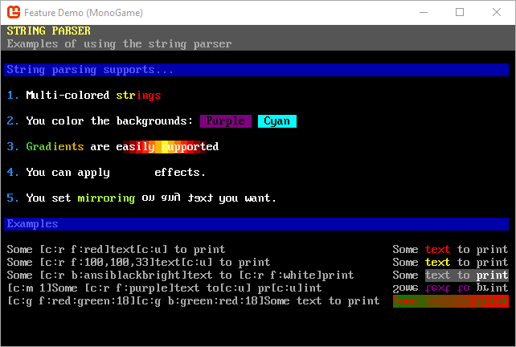
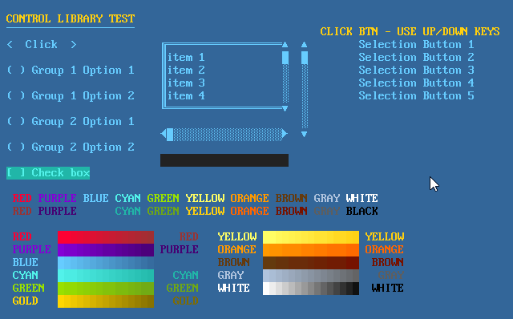
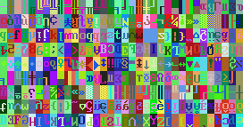

[][github]

SadConsole is an MonoGame 3.6-based game library that provides an engine to emulate old-school console and command prompt style graphics. One or more textures are used to represent the standard ascii character set. SadConsole allows you to create console instances which can be managed independently of each other. A console is made up of individual cells which can have a foreground, background, character, and a special effect applied to it. 

SadConsole targets Windows and Linux using MonoGame 3.6.

Some sample games are provided in the [SampleGames](./SampleGames) folder and are now part of the Visual Studio solution file.

* [Features](#features)
* [Demo video](#demo-video)

## Features

Here are some of the features SadConsole supports.

* Show any number of consoles
* Uses PNG graphic fonts supporting more than 256 characters
* Multiple fonts in your game
* Draggable console windows within the game
* Text GUI controls
* Full keyboard support
* Full mouse support
* Read ansi files from the good old DOS days
* Animation engine
* Instruction engine

#### String display and parsing

#### GUI library

#### Scrolling

#### Demo video
http://youtu.be/ZukjZIqDfJw

## Dependencies
SadConsole uses NuGet for its .NET dependencies.

## Demo Project
[DemoProject](./src/DemoProject) shows how to use SadConsole in a multi-platform environment and demonstrates various things you can do with SadConsole.

[github]: http://www.nuget.org/packages/SadConsole/