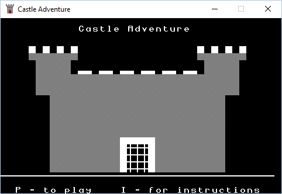
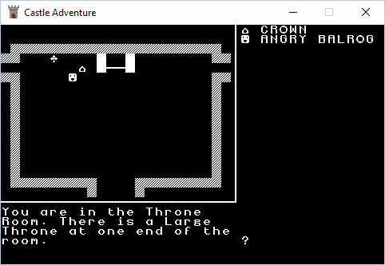

# SadConsole - Sample projects

The source code for some sample games are included here.

## Nokia Snake
A faux 90's nokia phone snake game. Created by Travis Luke

## Castle Adventure
A port of the Microsoft BASIC [Castle Adventure](https://en.wikipedia.org/wiki/Castle_Adventure) originally programmed by Kevin Bales and ported to C# and SadConsole by Travis Luke.

